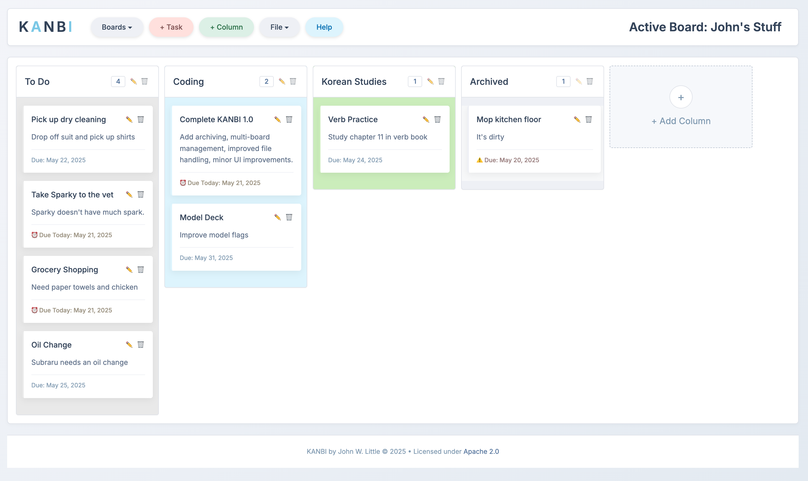

This project is licensed under the 

# KANBI

A lightweight, no-bullshit Kanban board application designed for simplicity and efficiency.

## About
KANBI helps you visualize your workflow, limit work-in-progress, and maximize productivity without the bloat of complex project management tools. It's designed to be straightforward, fast, and reliable.

## Core Philosophy
KANBI's ethos is centered around minimalism and practicality. We believe productivity tools should get out of your way and let you focus on what matters. The application adheres to these core principles:
- **Simplicity:** No unnecessary features or complex configurations
- **Speed:** Optimized for performance, even on older devices  
- **Privacy:** Your data stays on your device with local storage
- **Flexibility:** Customize your workflow without constraints
- **Portability:** Export and import your boards easily

## Features
- Customizable columns to match your workflow
- Intuitive drag-and-drop task management
- Due dates with visual indicators for approaching deadlines
- Automatic saving to local storage
- JSON export/import for backup and sharing
- Responsive design that works on desktop and mobile
- Visual customization with column colors

## Getting Started
1. Clone or download this repository. No dependencies, or server required.
2. Open `index.html` in your web browser
3. For the best experience, disable your browser's download confirmation popups:
   - **Chrome**: Go to Settings → Downloads and turn off "Ask where to save each file before downloading"
   - **Firefox**: Go to Settings/Preferences → General → Files and Applications and uncheck "Always ask you where to save files"
   - **Edge**: Go to Settings → Downloads and turn off "Ask me what to do with each download"
   - **Safari**: Go to Safari → Preferences → General and uncheck "Show downloads window when downloading files"
4. Start organizing your tasks!

**Note:** KANBI automatically saves backups to your browser's default download folder. Check this location periodically to find your auto-saved files (typically named `KANBI_Board_YYYY-MM-DD_HHMM.json`).

## Usage
See the built-in help documentation by clicking the "Help" button in the application, or view `kanbi-help.html` directly for detailed usage instructions.

## Data Storage & Backup

### Local Storage
Your data is stored in your browser's local storage. This means:
- Your board data persists between sessions
- Data is specific to the browser you're using
- Clearing browser data will erase your board

### Auto-Save & Exports
KANBI features automatic backup functionality:
- Changes are automatically saved to local storage
- The app automatically exports JSON backups to your **Downloads** directory
- Exported files use the naming format: `KANBI_Board_YYYY-MM-DD_HHMM.json`

### Browser Settings
For the best experience with KANBI:
- Consider disabling download confirmation popups in your browser settings
- This prevents interruptions when auto-save creates backup files
- Check your browser's download settings to configure this option

### Data Management
- Export manually before making significant changes
- Regularly clean your Downloads folder to avoid clutter
- Import previously exported boards if you need to restore data

Here's a cleaned-up version of your limitations section:

## Limitations & Workarounds
- **Single Board Limitation:** KANBI supports one board per browser instance. For multiple boards, clone the KANBI files into different directories.
- **File Management:** The auto-backup system creates regular JSON exports to your downloads folder. Consider disabling your browser's download popup notifications for a smoother experience, and periodically clean up accumulated files.
- **Mobile Compatibility:** Some mobile browsers have limited support for file storage operations, which may affect export/import functionality. Results vary by device and browser.
- **Local by Design:** KANBI intentionally stores data locally without cloud synchronization. This approach maximizes privacy and simplicity, though cloud/sync features may be considered for future versions.

## License
This work is licensed under a [Creative Commons Attribution-NonCommercial 4.0 International License](https://creativecommons.org/licenses/by-nc/4.0/).

This means you are free to:
- Share — copy and redistribute the material in any medium or format
- Adapt — remix, transform, and build upon the material

Under the following terms:
- Attribution — You must give appropriate credit, provide a link to the license, and indicate if changes were made.
- NonCommercial — You may not use the material for commercial purposes.

© 2025 John W. Little
